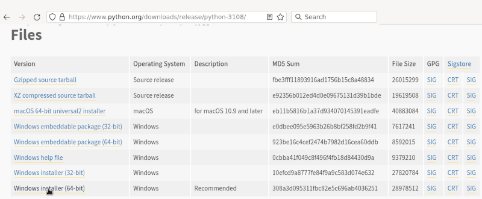
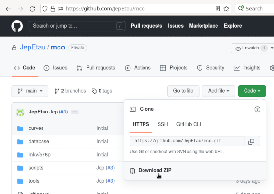

# Tutoriaux concernant le dépôt [MCO](https://github.com/JepEtau/mco)

- Il est conseillé pour les ceux qui souhaitent utiliser plusieurs environnements/versions de Python d'utiliser des environnements virtuels: Anaconda, pyenv, virtualenv, de multiples sessions Windows, WSL, ou autre. De multiples informations, documentations et tutoriels sont disponible sur internet

- N'est détaillé ici qu'une installation sous Windows 11 sans environnement virtuel et de façon simpliste. Le projet a été testé sur Windows 11 et sur une distribution Debian GNU/Linux 11 (bullseye)


## Installations (Windows 11)
</br>

### Python

1) Télécharger Python **3.10**: https://www.python.org/downloads/

2) Installation: [documentation sur python.org](https://docs.python.org/fr/3.10/using/windows.html#windows-full)
4) **[Documentation python, tutoriels, vocabulaire](https://docs.python.org/fr/3.10/)**
3) Vérifier que python a bien été installé en identifiant la version dans une "invite de commande" (cmd.exe) ou "fenêtre Powershell":
en exécutant la commande:
```
python --version
```
</br>

### Modules python
1) lors de l'éxécution d'une des commandes, il sera sans doute demandé de mettre à jour 'pip' en exécutant la commande: ```python.exe -m pip install --upgrade pip```, ce qui est on ne peut plus recommandé de faire auparavant.
2) Dans l'invite de commande ou fenêtre powershell exécuter les commandes suivantes:
```
pip install numpy
pip install opencv-python
pip install scikit-image
```


### Téléchargement du projet
1) Sur la page principale, cliquer sur le bouton "Code" et choisir 'Download ZIP'

</br>

2) Extraire les fichiers (le répertoire utilisé est D:\ dans les exemples suivants)
4) Installer les programmes et placer les fichiers specifiés. Se reporter à la [page principale du dépôt](https://github.com/JepEtau/mco)
3) Copier les fichiers video d'entrée dans les répertoires comme indiqués sur la [page principale du dépôt](https://github.com/JepEtau/mco)
</br></br>

### Vérification
1) Exécuter les commandes suivantes pour vérifier que tout fonctionne correctement
```
D:
cd mco\scripts
python run.py --episode 1 --vfilter deinterlace
```

Note: Pour une vérification moins longue, il est conseillé d'exécuter la commande `python run.py --part g_debut --vfilter deinterlace`